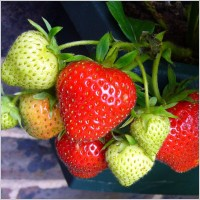
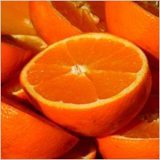
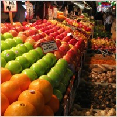

---
title       : The Fruit Consumption Web Application
subtitle    : How much fruit do we eat...?
author      : Vishal Arora
job         : 
framework   : io2012        # {io2012, html5slides, shower, dzslides, ...}
highlighter : highlight.js  # {highlight.js, prettify, highlight}
hitheme     : tomorrow      # 
widgets     : []            # {mathjax, quiz, bootstrap}
mode        : standalone # {standalone, draft}
knit        : slidify::knit2slides

--- 

{class: class1, id: id1, bg: yellow}
## Benefits of Eating Fruit
Who can resist the bright colors and sweet taste of a piece of fruit?
But fruit is more than tasty--it's also good for you. Check out these facts about the nutrients found in fruit:
- **Potassium** may help maintain a healthy blood pressure.
- **Dietary fiber** from fruits helps reduce blood cholesterol levels and may lower risk of heart disease. 
- **Vitamin C** is important for growth and repair of all body tissues, helps heal cuts and wounds, and keeps teeth and gums healthy.
- **Folate** (folic acid) helps the body form red blood cells. 
<p>++From [ChooseMyPlate.gov](http://www.choosemyplate.gov/food-groups/fruits-why.html)</p>


--- {class: class1, id: id1, bg: lime}

## The Web App!   
- Studies have shown that fruit consumption varies according to different personal factors.
- Now, there's a web app to help you see the average amounts of nine different fruits that people who have factors similar to yours eat daily.
- Considers income, gender, age, weight, education and race/ethnicity.
- Based on data compiled by the USDA.

### Fruits included in the data set:
```{r,echo=FALSE}
# Load data
fruit_file <- "ficrcd_fruit.csv"
fruit <- read.csv(fruit_file)
colnames(fruit)[3:11]
```

--- {class: class1, id: id1, bg: fuchsia}

## The User Interface

To use the app, simply make your selections on the left side of the web page and press the Submit! button.

 

--- {class: class1, id: id1, bg: orange}

## The Results

Results are displayed in an easy-to-read barplot. Try it out for yourself before heading for the fruit market!

!   

